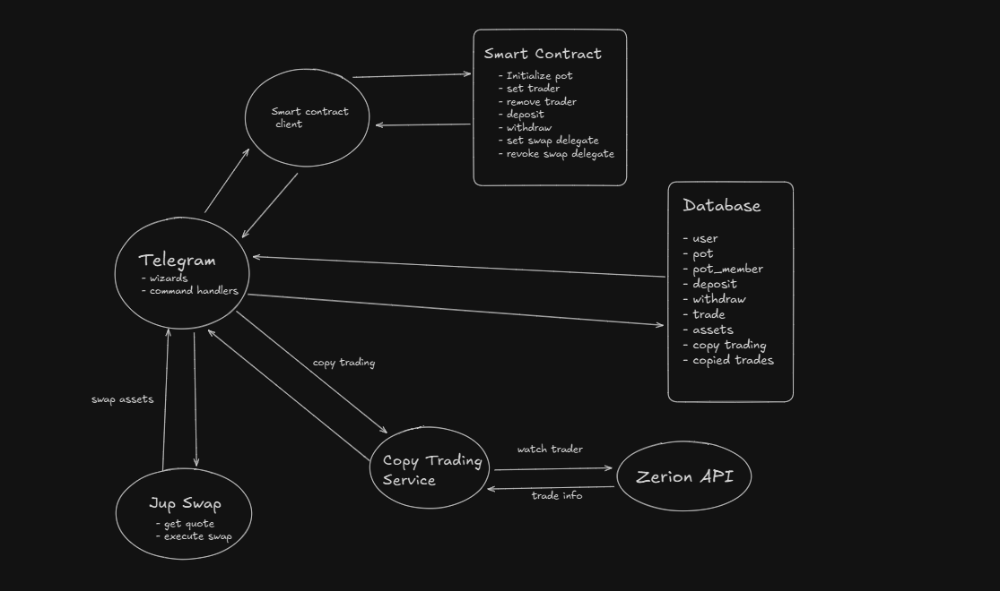

# PotBot — BONK Bot for Telegram Group Chats

> Turning Telegram group chats into gamified hedge funds controlled by smart contracts on Solana.

[](https://solana.com)
[](https://www.typescriptlang.org/)
[](https://www.anchor-lang.com/)

---

## Description

**PotBot** transforms Telegram group chats into collaborative, decentralized investment vehicles. It allows groups of friends, traders, or communities to pool capital into a shared "pot" where designated traders can execute trades programmatically through Telegram commands—all secured by Solana smart contracts.

Whether you're running a degen trading group, testing investment strategies with friends, or exploring DeFi as a community, PotBot gives you the tools to trade collectively while maintaining full transparency and on-chain security.

**Target Users:**
- Crypto trading communities and Telegram groups
- Friends pooling money for collaborative trading
- Influencers running copy-trading groups
- DeFi enthusiasts exploring group fund management

---

## Pitch and Demo Links

- [Pitch Deck Video](https://youtu.be/C8cwOShF0zE)
- [Technical Demo Video](https://youtu.be/1CRiuu353Fo)
- [Pitch Deck (Canva)](https://www.canva.com/design/DAG2yhEbAew/i8RNtv-9ie2r3hu0iJhTdg/view)

---

## Key Features

### **Group Trading (Collective Pots)**
- **Pooled Capital**: Group members contribute SOL to a shared pot managed collectively
- **Permissioned Traders**: Only designated traders can execute trades on behalf of the group
- **Instant Withdrawals**: Members can withdraw their proportional share anytime
- **Share-Based System**: Fair capital distribution based on deposit shares
- **Transparent Tracking**: View group portfolio, recent trades, and transactions

### **Copy Trading (Private DMs)**
- **Automated Mirror Trading**: Automatically replicate trades from successful wallets
- **Real-Time Monitoring**: 30-second polling for new transactions via **Zerion API**
- **Trade Filtering**: Only copies confirmed "trade" type transactions
- **Private & Secure**: Works exclusively in private DMs with the bot
- **Status Tracking**: View copied trades, success rate, and recent activity
- **Powered by Zerion**: Leverages Zerion API for real-time transaction monitoring and trade detection

### **Personal Trading**
- **Buy/Sell Tokens**: Execute Jupiter swaps directly through Telegram
- **Wallet Management**: Each user gets a Solana wallet managed by the bot
- **Balance Tracking**: Check SOL balance and token holdings
- **Private Key Access**: Export your private key for external wallet use
- **Portfolio View**: See your positions, recent trades, and transactions powered by **Zerion API**
- **Real-Time Pricing**: Accurate token prices and portfolio valuation via Zerion integration

### **Security & Smart Contracts**
- **On-Chain Logic**: All pot operations secured by Anchor smart contracts
- **Solana Program**: Deployed at `636NmFV9Nhr2TV49RyjJUp2kyBVbnZFMmPqQjvHeJNzU`
- **Trader Permissions**: Add/remove traders via on-chain instructions
- **Performance & Redemption Fees**: Configurable fee structure per pot
- **Swap Delegation**: Traders use delegated authority for secure swaps

> **⚠️ Implementation Note**: The smart contract is currently deployed on Solana Devnet. As Jupiter swaps are not available on Devnet (as per recommendations from Superteam member (Shek)), we have implemented a simplified off-chain approach using separate vault wallets instead of PDAs for demonstration purposes. The complete smart contract infrastructure is production-ready and will be deployed on Mainnet following a security audit.

---

## How It Works

### **Creating and Managing Pots**

1. **Create a Pot**
   - User clicks "Create Pot" in private DM with the bot
   - Bot generates a unique pot wallet and seed on Solana
   - Admin creates a Telegram group and adds the bot
   - Bot automatically links the group to the pot

2. **Add Members**
   - Admin generates an invite link through the bot
   - New members click the invite link and join the group
   - Members can deposit SOL to receive proportional shares

3. **Set Traders**
   - Admin uses `/settrader <wallet_address>` to grant trading permissions
   - Traders can buy/sell tokens using group funds via Jupiter swaps
   - Admin can remove traders with `/removetrader <wallet_address>`

4. **Trading**
   - Traders execute buy/sell commands in the group chat
   - Bot routes trades through Jupiter aggregator for best prices
   - All trades are recorded on-chain and in the database
   - Group can view portfolio and trade history anytime

5. **Withdrawals**
   - Members can withdraw their share of the pot at any time
   - Bot calculates proportional value across all assets
   - If necessary, assets are swapped to SOL via Jupiter
   - SOL is transferred to the user's wallet

### **Copy Trading Flow**

1. User starts copy trading via `/copytrade` command in private DM
2. User enters the Solana wallet address to copy
3. Bot monitors the target wallet every 30 seconds via **Zerion API**
4. When a trade is detected (via Zerion's transaction feed), bot replicates it using Jupiter swaps
5. User can check status with `/copytradestatus` or stop with `/stopcopytrade`

> **💡 Zerion Integration**: Copy trading is powered by Zerion API, which provides real-time transaction monitoring, trade detection, and portfolio tracking across Solana wallets. This enables accurate trade replication and portfolio analysis.

---

## 🚀 Getting Started

### **Prerequisites**

- [Bun](https://bun.sh/) (JavaScript runtime)
- [Rust & Anchor](https://www.anchor-lang.com/docs/installation) (for smart contracts)
- PostgreSQL database
- Telegram Bot Token ([create one via @BotFather](https://t.me/botfather))
- Solana wallet with SOL on devnet

### **Installation**

1. **Clone the repository**
   ```bash
   git clone https://github.com/sahilkhude117/potbot.git
   cd potbot
   ```

2. **Install dependencies**
   ```bash
   bun install
   ```

3. **Set up environment variables**
   
   Copy the example environment file and fill in your credentials:
   ```bash
   cp .env.example .env
   ```
   
   Then edit `.env` with your actual values (see `.env.example` for all required variables).

4. **Set up the database**
   ```bash
   cd prisma
   bunx prisma migrate dev
   bunx prisma generate
   ```

5. **Deploy smart contracts (optional for local testing)**
   ```bash
   cd smart-contracts
   anchor build
   anchor deploy
   ```

6. **Run the bot**
   ```bash
   bun run dev
   ```

### **Usage**

#### **Private Commands**
- `/start` - Initialize your wallet and see available actions
- `/deposit` - Deposit SOL to your personal wallet
- `/withdraw` - Withdraw SOL from your wallet
- `/help` - View all available commands
- `/copytrade` - Start copy trading a wallet
- `/stopcopytrade` - Stop copy trading
- `/copytradestatus` - Check copy trading status
- `/portfolio` - View your holdings
- `/transactions` - View recent transactions
- `/trades` - View recent trades

#### **Group Commands**
- `/settrader <wallet>` - Add a trader to the pot (admin only)
- `/removetrader <wallet>` - Remove a trader (admin only)
- `/traders` - View all traders
- `/traderhelp` - Get help on trader management
- `/portfolio` - View group portfolio
- `/transactions` - View group transactions
- `/trades` - View group trades

#### **Inline Actions**
- **Balance** - Check SOL balance
- **Buy** - Buy tokens with SOL (Jupiter swap)
- **Sell** - Sell tokens for SOL (Jupiter swap)
- **Create Pot** - Start a new group pot
- **Join Pot** - Join an existing pot
- **Show Pots** - View your active pots

---


### **System Flow**



**Key Integrations:**
- **Zerion API**: Powers copy trading by monitoring wallet transactions in real-time, provides portfolio data, token prices, and transaction history
- **Jupiter Aggregator**: Executes all token swaps with optimal routing and best prices
- **Solana Smart Contracts**: Manages pot ownership, shares, trader permissions, and fee structures on-chain

### **Smart Contract Structure**

**Program ID**: `636NmFV9Nhr2TV49RyjJUp2kyBVbnZFMmPqQjvHeJNzU`

**Key Instructions:**
- `initialize_pot` - Create a new pot with fees and base mint
- `add_trader` - Grant trading permissions to a wallet
- `remove_trader` - Revoke trading permissions
- `deposit` - Add funds and mint shares
- `redeem` - Burn shares and withdraw funds
- `set_swap_delegate` - Authorize trader for a single swap
- `revoke_swap_delegate` - Cancel swap authorization

**PDA Derivation:**
- Pot PDA: `["pot", admin_pubkey, pot_seed]`
- Member PDA: `["member", pot_pda, user_pubkey]`

---

## 🤝 Contribution Guidelines

We welcome contributions! Please follow these steps:

1. Fork the repository
2. Create a feature branch (`git checkout -b feature/amazing-feature`)
3. Commit your changes (`git commit -m 'Add amazing feature'`)
4. Push to the branch (`git push origin feature/amazing-feature`)
5. Open a Pull Request

### **Development Guidelines**
- Write clear commit messages
- Add tests for new features
- Update documentation as needed
- Follow existing code style (TypeScript + Prettier)

---

### **Contact & Support**
- **Live Bot**: [@solana_pot_bot](https://t.me/solana_pot_bot)
- **Telegram Support**: [Contact Us](https://t.me/sahil11_here)
- **GitHub**: [sahilkhude117/potbot](https://github.com/sahilkhude117/potbot)
- **Email**: sahilkhude11@gmail.com

---

## 🎖️ Acknowledgments

Built with ❤️ for the Solana ecosystem using:
- [Anchor Framework](https://www.anchor-lang.com/) - Smart contract development
- [Jupiter Aggregator](https://jup.ag/) - Decentralized token swaps
- **[Zerion API](https://zerion.io/)** - Portfolio tracking, transaction monitoring, and copy trading infrastructure
- [Telegraf.js](https://telegraf.js.org/) - Telegram bot framework
- [Prisma ORM](https://www.prisma.io/) - Type-safe database access

**Special Thanks:**
- Zerion team for providing robust API infrastructure for wallet monitoring and portfolio management
- Superteam members for guidance on Solana devnet best practices

---

**Made for Cypherpunk, built for the community. Let's make DeFi social! 🚀** 
